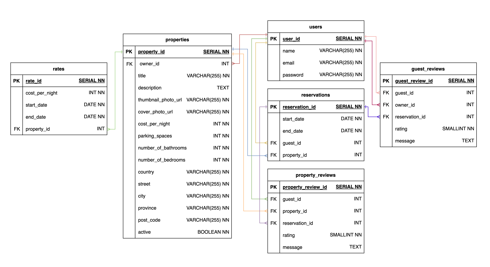

# LightBnB

A simple multi-page Airbnb clone that uses a server-side Javascript to display the information from queries to web pages via SQL queries.

## Purpose

This project was built as a part of my learnings at [Lighthouse Labs](https://www.lighthouselabs.ca).

## Getting Started

1. Clone the repository onto your local device.
2. Create and connect to a PostgreSQL database.
3. Run the schema and seed files to load in the database.
4. With the database setup, `cd` into LightBnb_WebApp-master.
5. Install dependencies using the `npm install` command.
6. Start the web server using the `npm run local` command. The app will be served at <http://localhost:3000/>.
7. Go to <http://localhost:3000/> in your browser.

## ERD

## Dependencies
- Node.js
- Express
- bcryptjs
- cookie-session
- nodemon
- pg